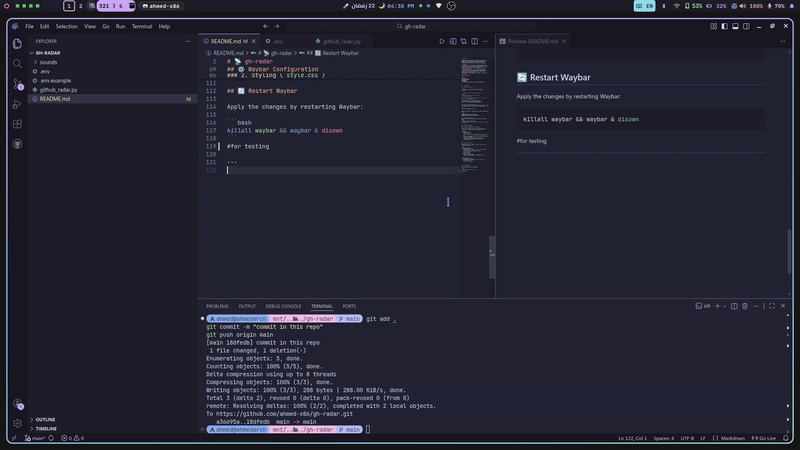

# 📡 gh-radar

A dynamic and interactive Waybar module that monitors your GitHub activity in real-time. It features an animated ticker (Commit ➔ Repo ➔ Username), sound alerts, and desktop notifications with user avatars. Never miss a push again!

## ✨ Features
- **Animated Ticker**: Waybar text changes dynamically when a new push occurs (shows the branch and commit message, then the repository name, and returns to your username).
- **Audio Alerts**: Plays a retro notification sound upon detecting a new push.
- **Avatar Notifications**: Sends a desktop notification containing the committer's GitHub avatar and commit details.
- **Interactive**: Left-click to open your GitHub profile, Right-click to open notifications.
- **Manual Refresh (New!)**: Middle-click the module to instantly fetch the latest updates using Linux signals (`SIGUSR1`).
- **Smart Resource Management**: Dynamic polling intervals (10s when active, 60s when idle) or a complete Sleep Mode (`-t 0`) to save battery and bandwidth.
- **Optimized**: Uses GitHub's `ETag` headers to respect API rate limits.

<br>
<div align="center">
  
  <p><i>Watch gh-radar in action!</i></p>
</div>
<br>

## 📂 File Structure
```text
.
├── .env
├── .env.example
├── github_radar.py
├── README.md
└── sounds
    └── freesound_community-retro-audio-logo-94648.mp3
```

## 🚀 Installation

**1. Clone the repository**

```bash
git clone https://github.com/ahmed-x86/gh-radar.git
cd gh-radar
```

**2. Copy files to your `.config` directory**

```bash
# Copy the sound file to your config folder
cp -r sounds ~/.config/
```
```
# Create the scripts directory for Waybar if it doesn't exist
mkdir -p ~/.config/waybar/scripts
```
```
# Copy the Python script and make it executable
cp github_radar.py ~/.config/waybar/scripts/
chmod +x ~/.config/waybar/scripts/github_radar.py
```

**3. Set up your Credentials (.env)**
The script requires a GitHub Personal Access Token (PAT) to read your events. Create a `.env` file in the scripts folder:

```bash
nano ~/.config/waybar/scripts/.env
```

Add the following lines (replace with your actual username and token):

```env
GITHUB_USERNAME=your_github_username
GITHUB_PAT=your_personal_access_token_here
```

**4. Install Dependencies**
Make sure you have the required Python libraries and system tools:

```bash
pip install requests python-dotenv
# Ensure you have 'mpv' (or 'paplay') and 'libnotify' installed on your system
# or install it by pacman
# sudo pacman -S python-requests python-dotenv
```

## ⚙️ Usage & Arguments

The script supports arguments to customize its behavior:

* **`my_repos_only`**: Only triggers alerts for repositories you own (ignores activity from other repos you watch/star).
* **`-t 0`**: **Manual Mode**. The script will not poll GitHub automatically. It will sleep completely until you middle-click the Waybar module.

**Examples:**

* `github_radar.py` (Default: Tracks everything, dynamic polling)
* `github_radar.py my_repos_only` (Tracks only your repos, dynamic polling)
* `github_radar.py -t 0` (Tracks everything, manual middle-click refresh ONLY)
* `github_radar.py my_repos_only -t 0` (Tracks only your repos, manual middle-click refresh ONLY)

## 🖥️ Waybar Configuration

### 1. Module Configuration (`config.jsonc`)

Add the following module to your Waybar config file (under `modules-left`, `modules-center`, or `modules-right`):

```jsonc
"custom/github-radar": {
    "format": "{}",
    "return-type": "json",
    "exec": "~/.config/waybar/scripts/github_radar.py my_repos_only", // Add '-t 0' here if you want manual mode
    "on-click": "xdg-open https://github.com/ahmed-x86",
    "on-click-right": "xdg-open https://github.com/notifications",
    "on-click-middle": "pkill -USR1 -f github_radar.py", // Sends the refresh signal
    "restart-interval": 0 // Set to 0 because the script runs its own background loop
}
```

*(Note: Change `ahmed-x86` to your actual GitHub username in the `on-click` URL).*

### 2. Styling (`style.css`)

Choose the theme that matches your current Waybar setup and add it to your `style.css`.


#### 1. Default (GitHub Dark)

```css
/* GitHub Radar - Default Theme */
#custom-github-radar {
    background-color: #24292e; /* Dark GitHub background */
    color: #ffffff;
    border-radius: 10px;
    padding: 0px 10px;
    margin: 4px 5px;
    font-weight: bold;
    border: 1px solid #444c56;
    transition: all 0.3s ease;
}

#custom-github-radar:hover {
    background-color: #2ea043; /* GitHub green */
    color: #ffffff;
    border-color: #2ea043;
}
```
#### 2. Catppuccin
```css
/* GitHub Radar - Catppuccin Mocha Theme */
#custom-github-radar {
    background-color: #1e1e2e; /* Base */
    color: #cdd6f4; /* Text */
    border-radius: 10px;
    padding: 0px 10px;
    margin: 4px 5px;
    font-weight: bold;
    border: 1px solid #313244; /* Surface0 */
    transition: all 0.3s ease;
}

#custom-github-radar:hover {
    background-color: #a6e3a1; /* Green */
    color: #11111b; /* Crust for contrast */
    border-color: #a6e3a1;
}
```
#### 3. Dracula
```css
/* GitHub Radar - Dracula Theme */
#custom-github-radar {
    background-color: #282a36; /* Background */
    color: #f8f8f2; /* Foreground */
    border-radius: 10px;
    padding: 0px 10px;
    margin: 4px 5px;
    font-weight: bold;
    border: 1px solid #44475a; /* Selection */
    transition: all 0.3s ease;
}

#custom-github-radar:hover {
    background-color: #50fa7b; /* Green */
    color: #282a36; /* Background for contrast */
    border-color: #50fa7b;
}
```

## 🔄 Restart Waybar

Apply the changes by restarting Waybar:

```bash
killall waybar && waybar & disown 
```


---
